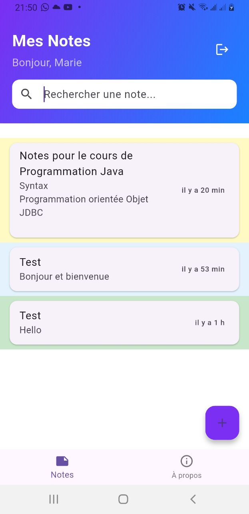

<<<<<<< HEAD
# Projet_Final_DCLIC_2025
NoteZone : Une application mobile de prise de notes sécurisée développée avec Flutter. Elle intègre une authentification utilisateur, une base de données locale SQLite et des fonctionnalités complètes de gestion de notes avec une interface fluide.
=======
# NoteZone

Application mobile de prise de notes sécurisée

## Description
NoteZone est une application Flutter permettant de gérer ses notes de façon sécurisée et intuitive. Elle propose une interface moderne, une authentification sécurisée, et un stockage local via SQLite.

## Fonctionnalités principales
- Connexion sécurisée (nom d'utilisateur + mot de passe)
- Liste des notes organisée et intuitive
- Ajout, modification et suppression de notes
- Recherche instantanée parmi les notes
- Stockage local avec SQLite
- Interface ergonomique et agréable
- Splashscreen personnalisé
- Déconnexion utilisateur
- Page "À propos" et mentions légales

## Installation
1. **Clonez ce dépôt :**
   ```bash
   git clone https://github.com/Patrickleondev/Projet_Final_DCLIC_2025.git
   cd Projet_Final_DCLIC_2025
   ```
2. **Installez les dépendances :**
   ```bash
   flutter pub get
   ```

## Compilation et build

### Android
Pour générer l'APK Android :
```bash
flutter build apk
```
Le fichier sera disponible dans `build/app/outputs/flutter-apk/app-release.apk`.

### iOS
> **ℹ️ Note importante :**
>
> La compilation iOS nécessite un environnement **macOS** avec **Xcode** installé.  
> Si vous êtes sous **Linux** ou **Windows**, la commande suivante **ne fonctionnera pas** :
>
> ```bash
> flutter build ios
> ```
>
> **Erreur attendue :**  
> `Could not find a subcommand named "ios"`
>
> **Pourquoi ?**  
> Flutter s'appuie sur Xcode pour compiler les applications iOS, or Xcode n'est disponible que sur Mac.
>
> **Solutions possibles :**
> - Développer et tester sur Android (recommandé sous Linux/Windows)
> - Utiliser un service cloud (Codemagic, GitHub Actions + MacStadium, etc.)
> - Compiler sur un Mac (si tu y as accès) :
>   ```bash
>   flutter build ios
>   ```

### Recommandation pour ce projet
- Le projet est **pleinement fonctionnel sur Android**.
- Le support iOS est prévu, mais la build finale doit être réalisée sur un Mac.
- N'hésitez pas à fournir des captures d'écran Android pour illustrer l'application.

## Structure du projet
- `lib/` : Code source principal de l'application
- `assets/logo.png` : Logo de l'application
- `Maquettes/` : Wireframes et maquettes de l'UI
- `pubspec.yaml` : Configuration des dépendances et assets

## Technologies utilisées
- Flutter
- SQLite (via sqflite)
- url_launcher (pour le support mail)
- flutter_native_splash (pour le splash natif)

## Maquettes
Les maquettes de l'application sont disponibles dans le dossier `Maquettes/`.

## Contact
Pour toute question ou suggestion : **gkpl0010@mail.com**

## Licence
MIT License

---
Développé par l'équipe NoteZone dans le cadre du projet de formation DCLIC 2025.
>>>>>>> f731744 (Livraison finale NoteZone - Projet DCLIC 2025)


